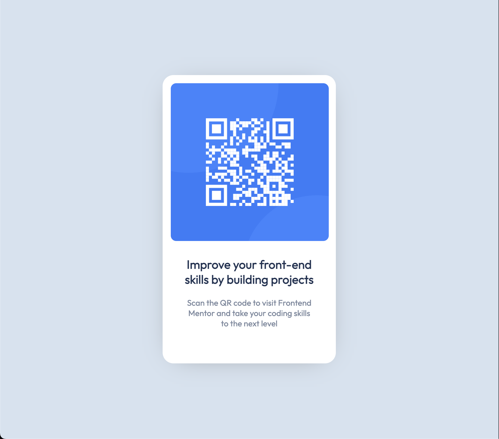

# Frontend Mentor - QR code component solution

This is a solution to the [QR code component challenge on Frontend Mentor](https://www.frontendmentor.io/challenges/qr-code-component-iux_sIO_H). Frontend Mentor challenges help you improve your coding skills by building realistic projects.

## Table of contents

- [Overview](#overview)
  - [Screenshot](#screenshot)
  - [Links](#links)
- [My process](#my-process)
  - [Built with](#built-with)
  - [What I learned](#what-i-learned)
  - [Continued development](#continued-development)
- [Author](#author)

## Overview

This was a super simple QR code scan page, built in about 30 minutes for fun.

### Screenshot



### Links

- Live Site URL: [https://khanhtruong0808.github.io/qr-code-component/](https://khanhtruong0808.github.io/qr-code-component/)

## My process

- Set background color
- Set center card / background
- Add image
- Add descriptions

### Built with

- Semantic HTML5 markup
- CSS custom properties
- Flexbox

### What I learned

Use of css variables

```css
:root {
  --light-gray: hsl(212, 45%, 89%);
  --dark-blue: hsl(218, 44%, 22%);
  --gray-blue: hsl(220, 15%, 55%);
}

.qr-container .qr-header {
  color: var(--dark-blue);
  font-weight: 700;
  font-size: 22px;
}
```

### Continued development

- Implementing a mobile-first style work-flow
- Work on responsive design

- Frontend Mentor - [@khanhtruong0808](https://www.frontendmentor.io/profile/khanhtruong0808)
